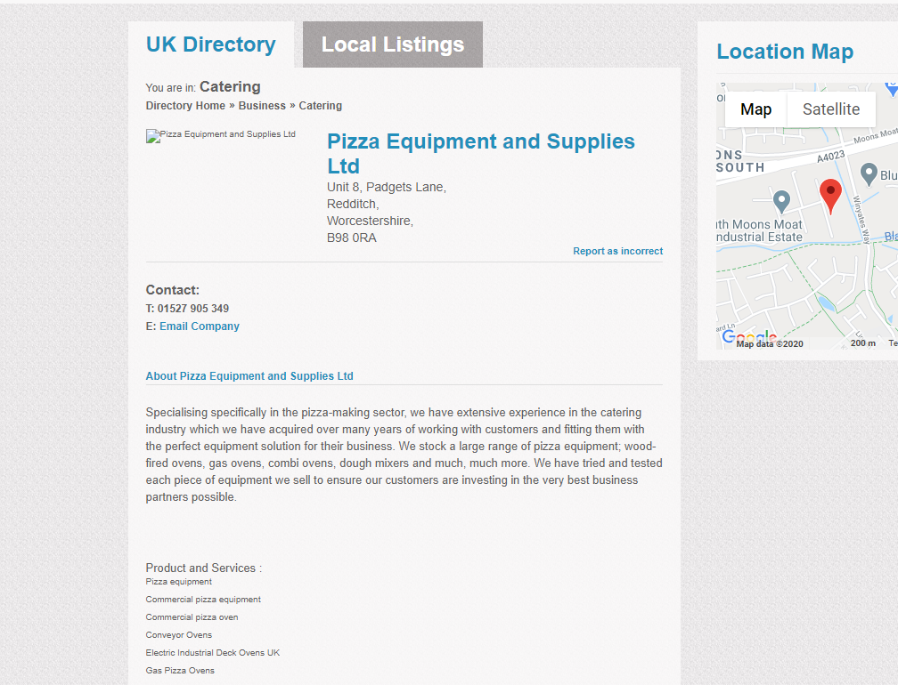

## Ukdirectory Python Scrapy Scraper

### Info

It's a scrapy project, code is very clean and simple to understand. Crawler going to each category and collecting link for the next request to getting each of the detail pages




### Requirements

> Must have scrapy or pip install scrapy

```
git clone https://github.com/mpalashb/ukdirectory_co_uk_pro
cd ukdirectory_co_uk_pro
scrapy crawl ukdirectory -o out.csv
```

> or change the name to replace out.csv
